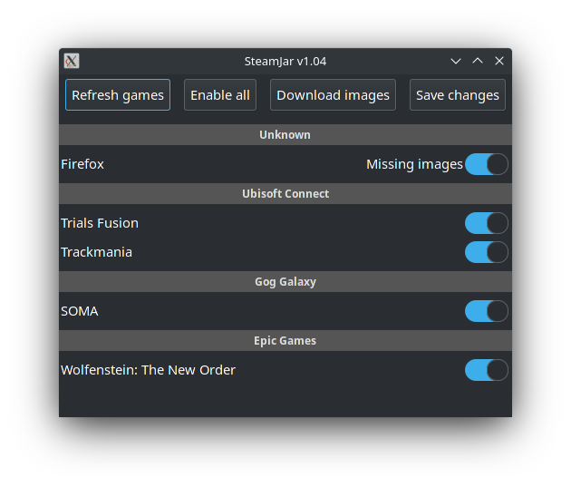
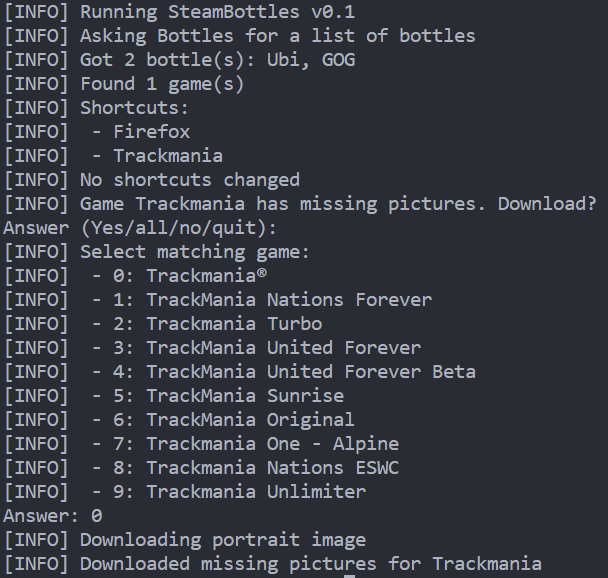

   
  
  
  

# What is SteamJar
SteamJar is a tool that helps you add all of your non-steam games to Steam.  
It will search for games from all supported game launchers from all known sources (Bottles, Wineprefixes) and add them as a non-steam applications.
Additionally - when missing pictures are detected, this tool will download them from SteamGridDB if you wish.
  
**[[./download_button.png|Download Installer]](https://pbaja.me/SteamJarInstaller.desktop)**  
  
**[See Changelog](./CHANGELOG.md)**  
  
## Supported Containers
|Container|Support|Note|
|---|---|---|
|Bottles|✅|Fully supported|
|Steam|❌|Planned soon|
|Wine|❌|Planned sometime in the future|

## Supported Launchers
|Launcher|Support|Note|
|---|---|---|
|GOG Galaxy|✅|Fully supported. Works great.|
|Ubisoft Connect|✅|Keeps running in the background after the game exits.|
|Epic Games Store|🚧|Works in desktop mode. In game mode launches in the background.|
|Origin|❌|Planned sometime in the future|

# Installation
Download installer from [here](https://pbaja.me/SteamJarInstaller.desktop) or [here](https://raw.githubusercontent.com/pbaja/SteamJar/dev/SteamJarInstaller.desktop). Save the file and run it.

**Manual method**  
Download the repository from [here](https://github.com/pbaja/SteamJar/archive/refs/heads/main.zip).
Unzip it and run the installer by clicking on the *SteamJarInstaller.desktop* file.
  
**Uninstalling**  
Just remove the `~/.steamjar` directory.

# Usage
- *Optionally* Press `Refresh games` button to search for games
- Enable or disable shortcuts. Disabled shortcuts will be removed when saved  
You can enable all by clicking on the `Enable all` button
- *Optionally* Click on the `Download images` button to download missing grid images
- Exit Steam if you haven't already
- Click on the `Save changes` to save enabled shortcuts to Steam 

## Roadmap
Things to do, sorted by priority.  
- Add simpler installation method
- Adding games from Origin
- Check if running games from EGS directly works / works better
- Check if running games from UbiConnect directly works / works better
- Code cleanup and documentation (types)
- Ability to edit shortcuts
- Ability to change images when editing
- Tests
- Juicify GUI - icons, tooltips, padding
- Adding standalone games
- Backing up your shortcuts, multiple sets?

### Extra
There are two commandline options:
 - `--cli` - Forces the use of a CLI interface
 - `--gui` - Forces the use of a GUI interface. It will fall back to CLI if GUI fails.
  

